# Diagramas de Arquitetura - Bridge

Este documento contém diagramas detalhados da arquitetura e fluxos de comunicação do projeto Bridge.

## Arquitetura Geral do Sistema

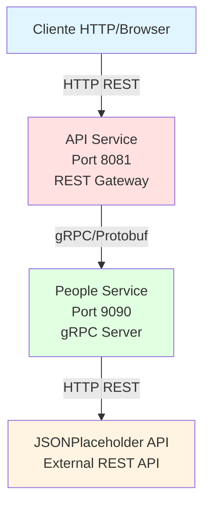

---

## Arquitetura Interna - API Service

```mermaid
graph TB
    subgraph "API Service - Clean Architecture"
        Controller[PeopleControllerImpl<br/>REST Endpoints<br/>@RequiredArgsConstructor]
        ServiceInterface[PeopleService<br/>Interface]
        ServiceImpl[PeopleServiceImpl<br/>@Service]
        RepoInterface[PeopleRepository<br/>Interface]
        RepoImpl[PeopleRepositoryImpl]
        ClientInterface[PeopleServiceClient<br/>Interface]
        GrpcClient[PeopleServiceGrpcClientImpl<br/>gRPC + MapStruct]
        Mapper[PeopleGrpcMapper<br/>MapStruct]

        Controller -->|injects| ServiceInterface
        ServiceInterface -->|implemented by| ServiceImpl
        ServiceImpl -->|uses| RepoInterface
        RepoInterface -->|implemented by| RepoImpl
        RepoImpl -->|uses| ClientInterface
        ClientInterface -->|implemented by| GrpcClient
        GrpcClient -->|uses| Mapper
    end

    GrpcClient -->|gRPC calls| PeopleService[People Service<br/>Port 9090]

    style Controller fill:#ff9999
    style ServiceInterface fill:#ffcc99
    style ServiceImpl fill:#ffcc99
    style RepoInterface fill:#99ccff
    style RepoImpl fill:#99ccff
    style GrpcClient fill:#99ff99
    style Mapper fill:#ffff99
```

---

## Arquitetura Interna - People Service

```mermaid
graph TB
    subgraph "People Service - Clean Architecture"
        GrpcService[PeopleServiceGrpcImpl<br/>gRPC Server<br/>@RequiredArgsConstructor]
        ServiceInterface[PeopleService<br/>Interface]
        ServiceImpl[PeopleServiceImpl<br/>@Service]
        RepoInterface[PeopleRepository<br/>Interface]
        RepoImpl[PeopleRepositoryImpl<br/>Strategy Pattern]
        ClientInterface[PeopleClient<br/>Interface]
        TypiClient[TypiCodeClientImpl<br/>HTTP Client]
        DummyClient[DummyClientImpl<br/>HTTP Client]
        TypiMapper[TypiCodeMapper<br/>MapStruct]
        DummyMapper[DummyMapper<br/>MapStruct]

        GrpcService -->|injects| ServiceInterface
        ServiceInterface -->|implemented by| ServiceImpl
        ServiceImpl -->|uses| RepoInterface
        RepoInterface -->|implemented by| RepoImpl
        RepoImpl -->|Strategy| ClientInterface
        ClientInterface -->|implemented by| TypiClient
        ClientInterface -->|implemented by| DummyClient
        TypiClient -->|uses| TypiMapper
        DummyClient -->|uses| DummyMapper
    end

    TypiClient -->|HTTP REST| TypiExternal[JSONPlaceholder API]
    DummyClient -->|HTTP REST| DummyExternal[DummyJSON API]

    style GrpcService fill:#99ff99
    style ServiceInterface fill:#ffcc99
    style ServiceImpl fill:#ffcc99
    style RepoInterface fill:#99ccff
    style RepoImpl fill:#99ccff
    style TypiClient fill:#ff99ff
    style DummyClient fill:#ff99ff
    style TypiMapper fill:#ffff99
    style DummyMapper fill:#ffff99
```

---

## Fluxo de Dados - GetPeople (Buscar por ID)

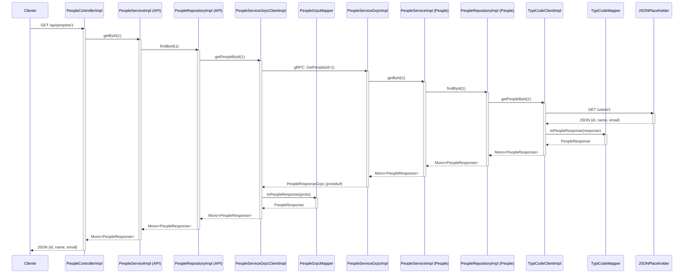

---

## Fluxo de Dados - ListPeople (Listar Todos)

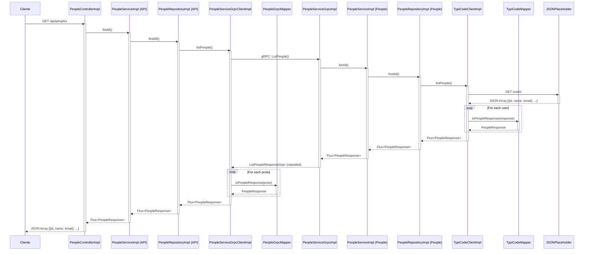

---

## Camadas da Clean Architecture

```mermaid
graph TB
    subgraph "Clean Architecture Layers"
        direction TB

        subgraph Presentation["Presentation Layer (Controllers/Entrypoints)"]
            REST[REST Controllers<br/>PeopleControllerImpl<br/>@RequiredArgsConstructor]
            GRPC[gRPC Services<br/>PeopleServiceGrpcImpl<br/>@RequiredArgsConstructor]
        end

        subgraph Application["Application Layer (Services + DTOs)"]
            ServiceInterface[PeopleService<br/>Interface]
            ServiceImpl[PeopleServiceImpl<br/>@Service]
            DTO[PeopleResponse<br/>DTO]
        end

        subgraph Domain["Domain Layer (Interfaces)"]
            RepoInterface[PeopleRepository<br/>Interface]
            ClientInterface[PeopleClient/PeopleServiceClient<br/>Interface]
        end

        subgraph Infrastructure["Infrastructure Layer (Implementations)"]
            RepoImpl[PeopleRepositoryImpl]
            GrpcImpl[PeopleServiceGrpcClientImpl]
            HttpImpl[TypiCodeClientImpl<br/>DummyClientImpl]
            Mapper[MapStruct Mappers<br/>PeopleGrpcMapper<br/>TypiCodeMapper<br/>DummyMapper]
        end

        REST -->|injects| ServiceInterface
        GRPC -->|injects| ServiceInterface
        ServiceInterface -->|implemented by| ServiceImpl

        ServiceImpl -->|uses| RepoInterface
        RepoInterface -->|implemented by| RepoImpl

        RepoImpl -->|uses| ClientInterface

        GrpcImpl -.implements.-> ClientInterface
        HttpImpl -.implements.-> ClientInterface

        GrpcImpl -->|uses| Mapper
        HttpImpl -->|uses| Mapper

        ServiceImpl -->|returns| DTO
    end

    style Presentation fill:#ffcccc
    style Application fill:#ffffcc
    style Domain fill:#ccffcc
    style Infrastructure fill:#ccccff
```

---

## Modelo de Dados

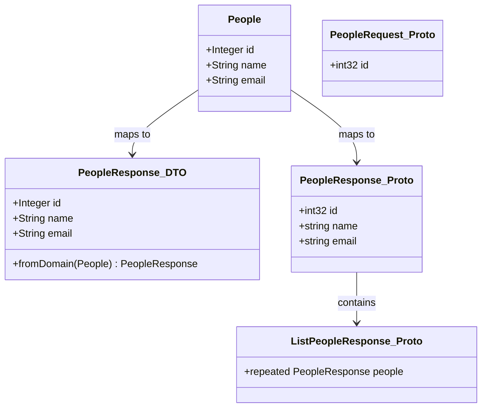

---

## Configuração de Rede

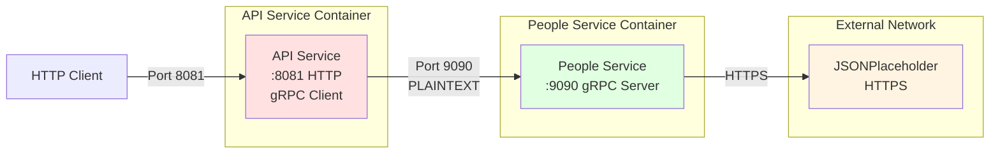

---

## Padrões de Comunicação

### 1. Comunicação Síncrona Reativa

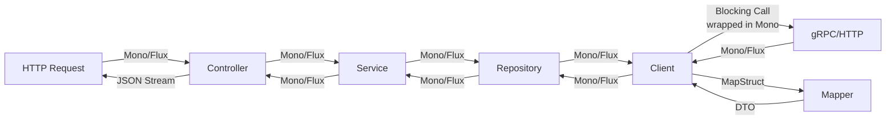

### 2. Transformação de Dados

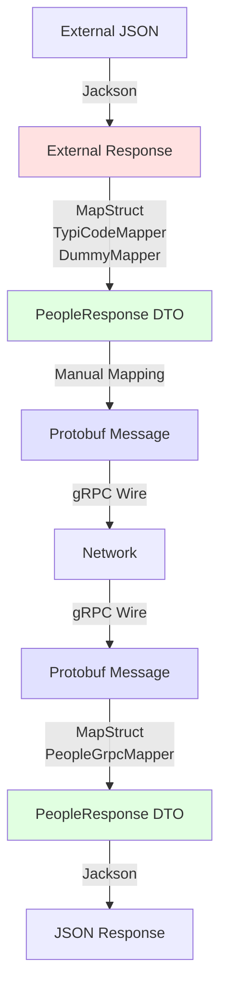

---

## Tratamento de Erros

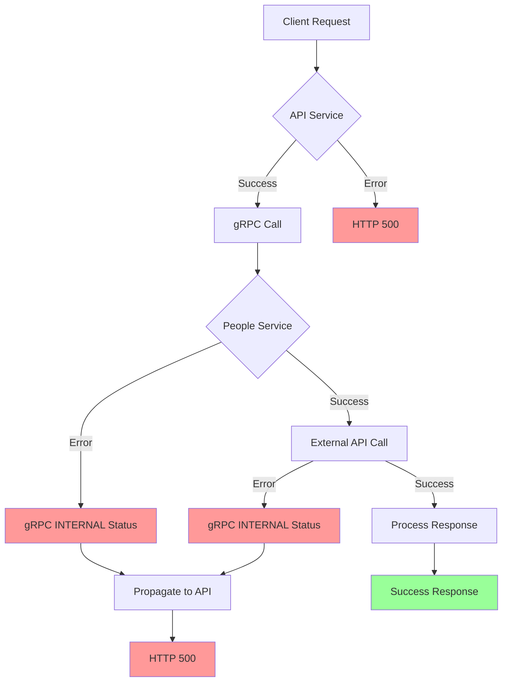

---

## Stack Tecnológico por Camada

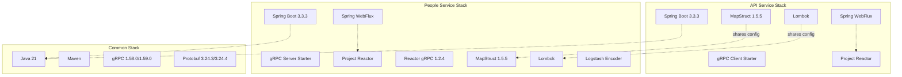

---

## Ciclo de Vida da Requisição

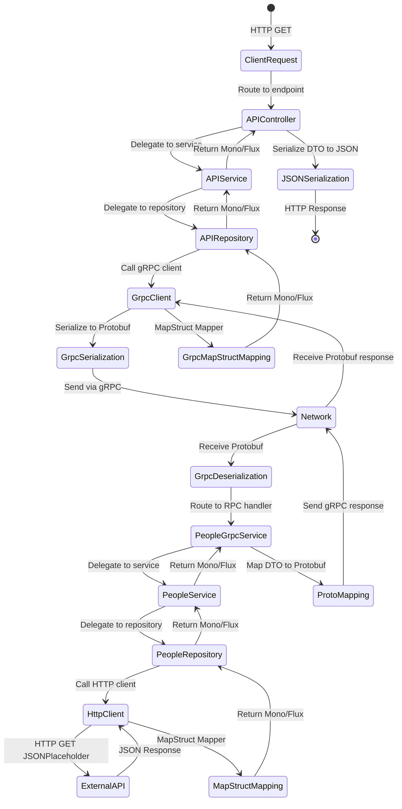

---

## Deployment Diagram

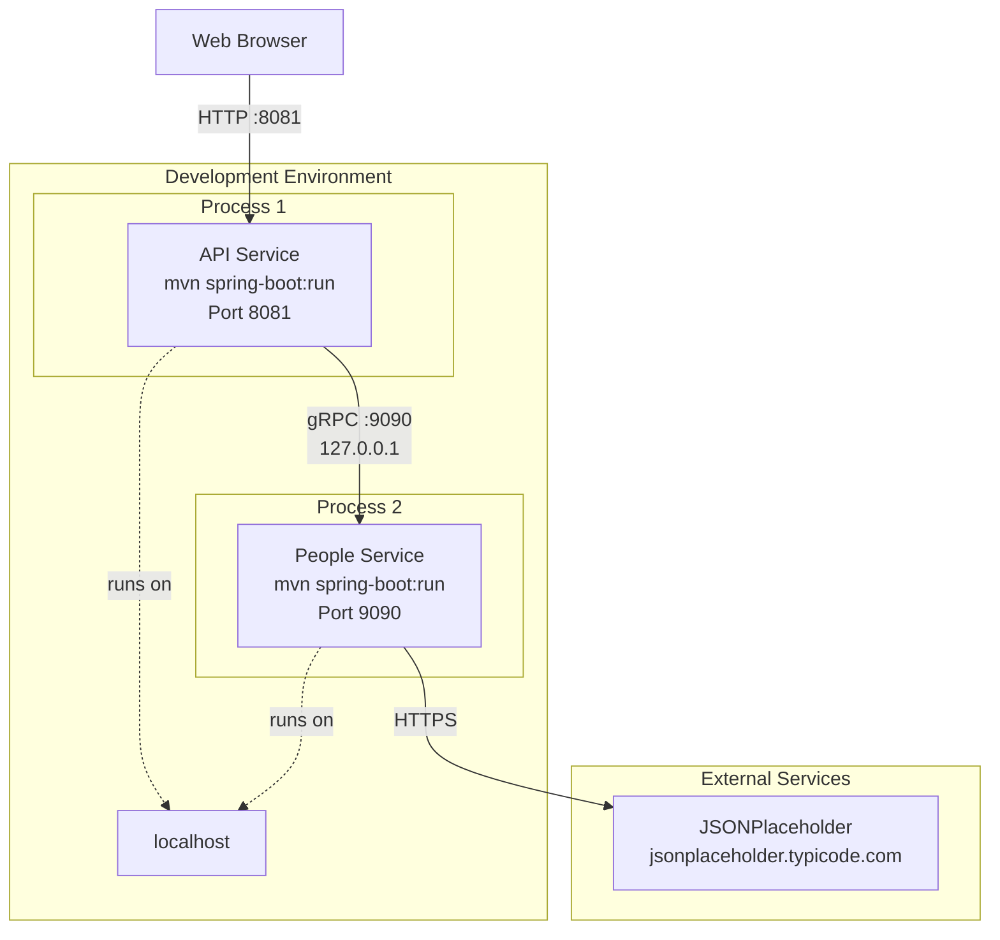

---

## Dependências entre Projetos

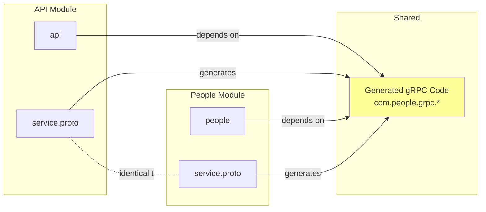

Este documento fornece uma visão visual completa da arquitetura do sistema Bridge, facilitando o entendimento dos fluxos de comunicação e das responsabilidades de cada componente.
