# Diagramas de Arquitetura - Bridge

Este documento contém diagramas detalhados da arquitetura e fluxos de comunicação do projeto Bridge.

## Arquitetura Geral do Sistema

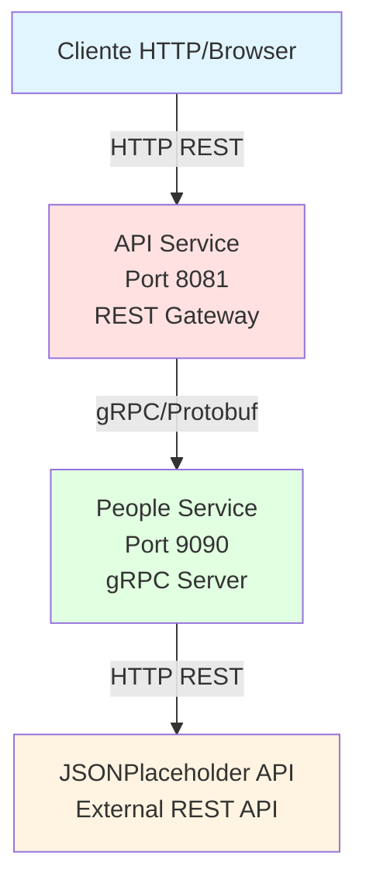

---

## Arquitetura Interna - API Service

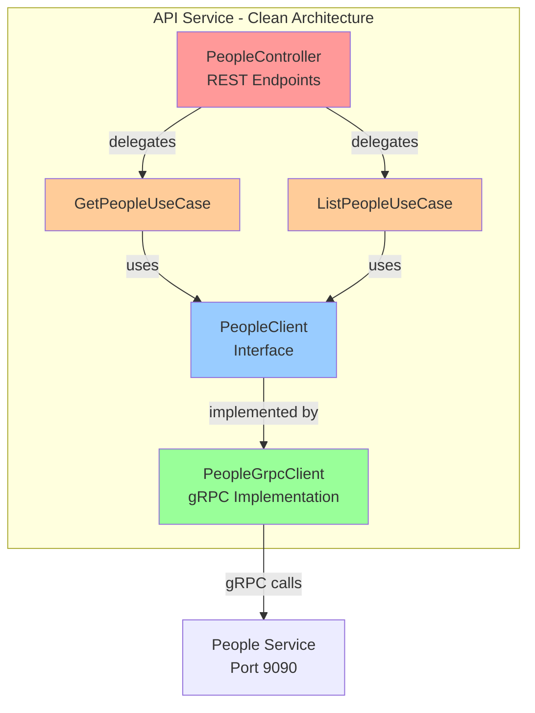

---

## Arquitetura Interna - People Service

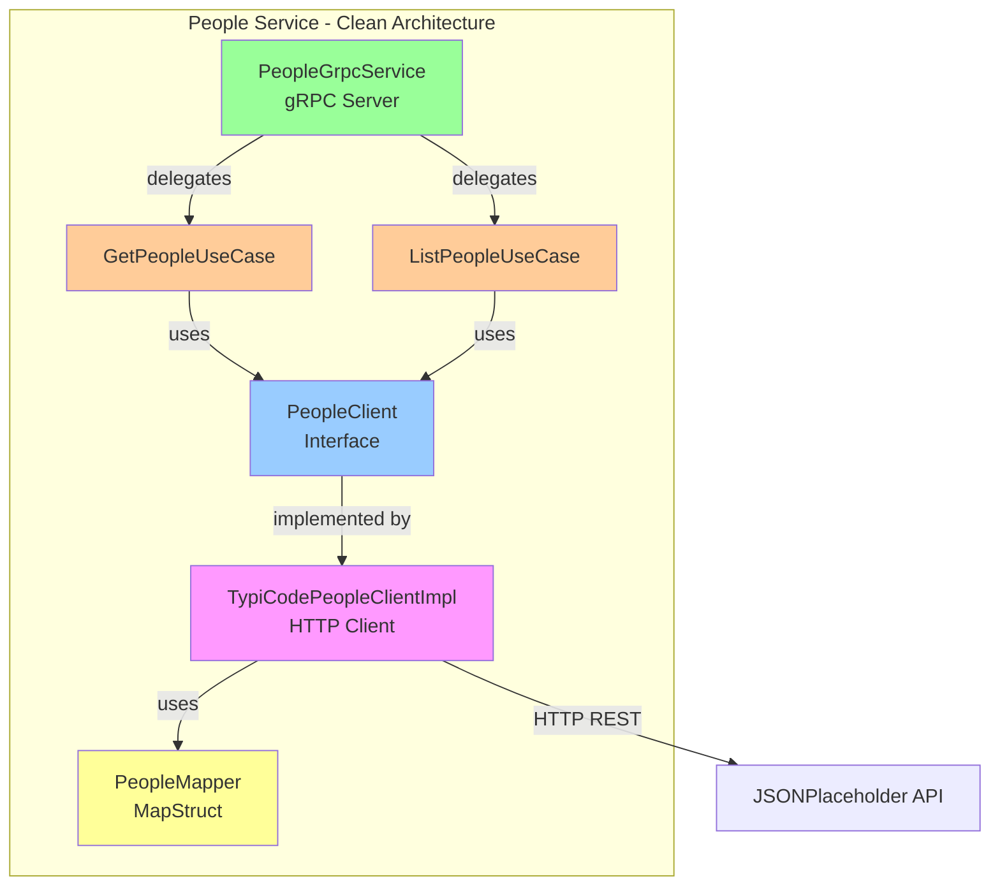

---

## Fluxo de Dados - GetPeople (Buscar por ID)

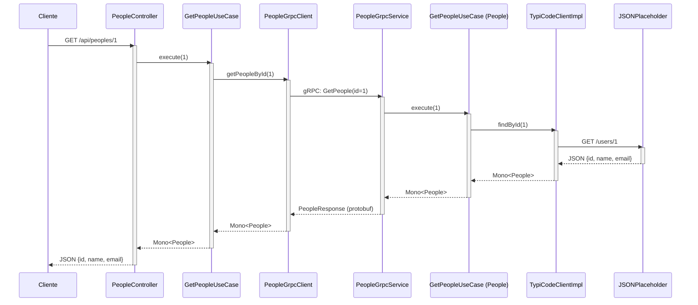

---

## Fluxo de Dados - ListPeople (Listar Todos)

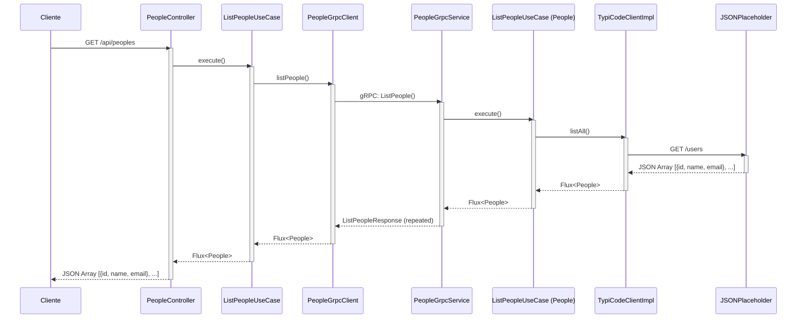

---

## Camadas da Clean Architecture

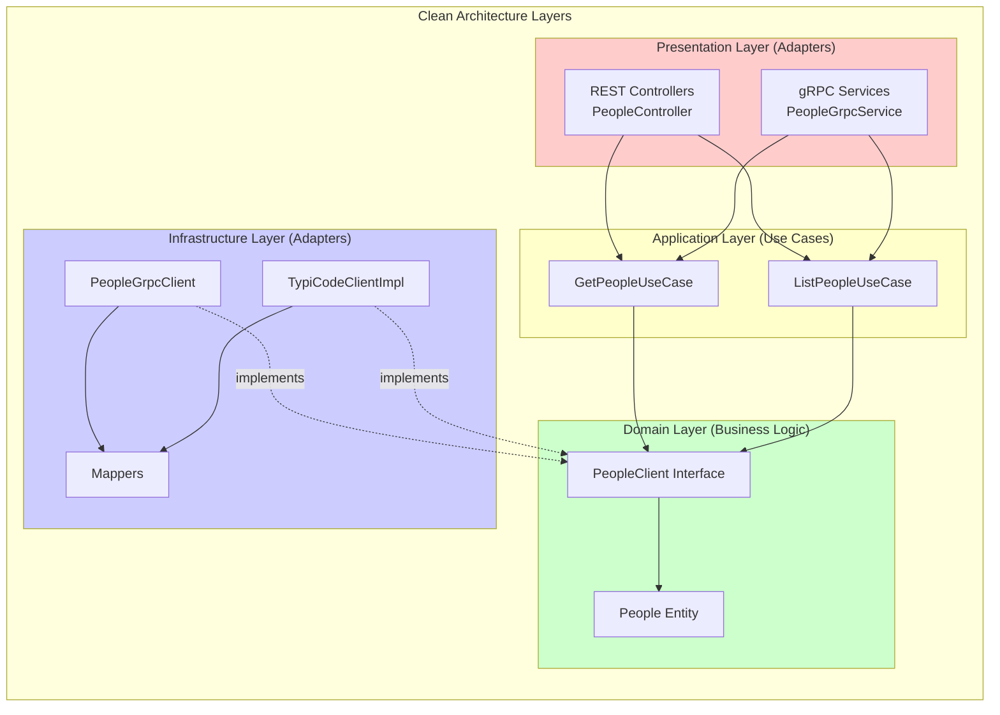

---

## Modelo de Dados

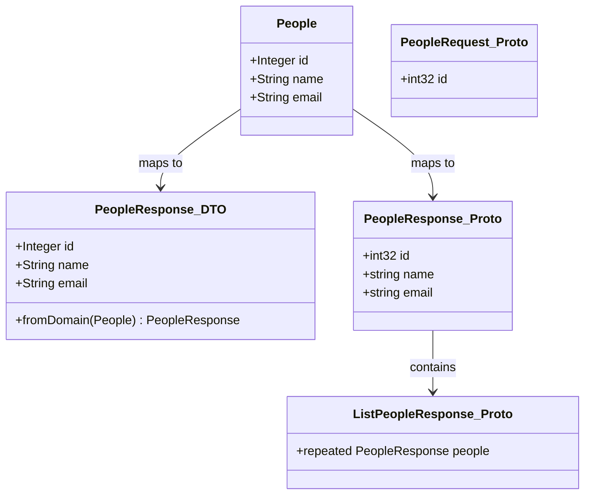

---

## Configuração de Rede

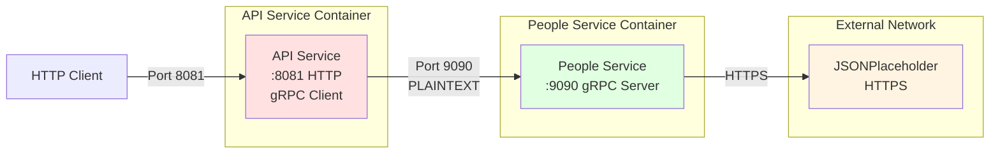

---

## Padrões de Comunicação

### 1. Comunicação Síncrona Reativa

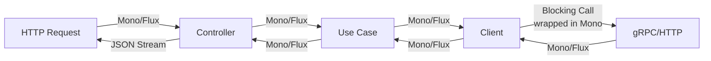

### 2. Transformação de Dados

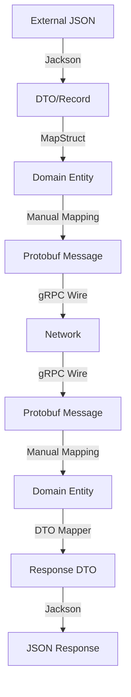

---

## Tratamento de Erros

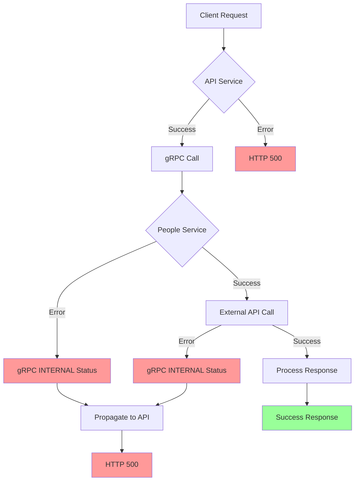

---

## Stack Tecnológico por Camada

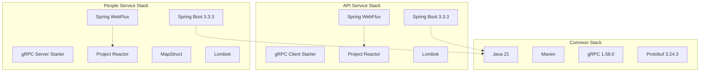

---

## Ciclo de Vida da Requisição

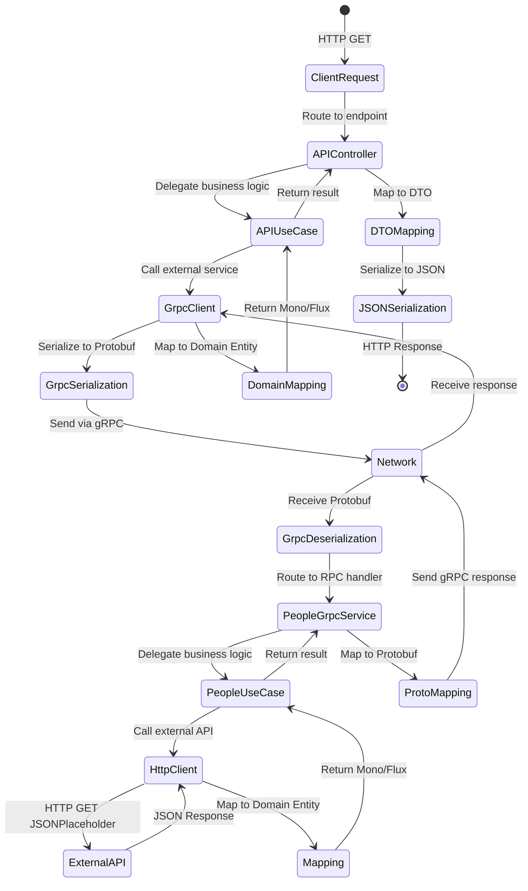

---

## Deployment Diagram

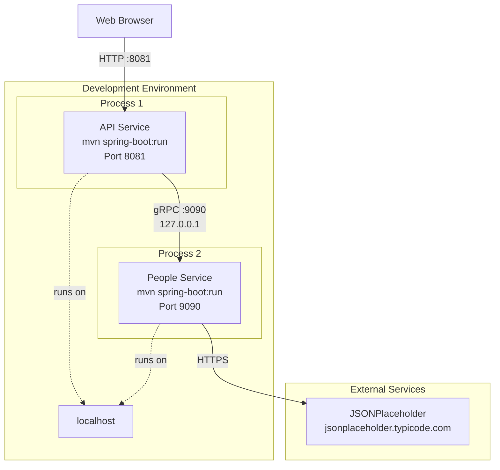

---

## Dependências entre Projetos

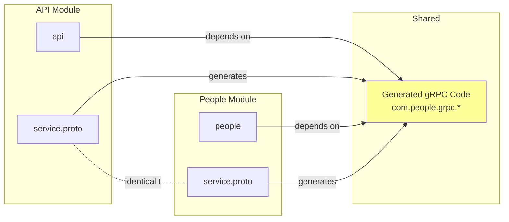

Este documento fornece uma visão visual completa da arquitetura do sistema Bridge, facilitando o entendimento dos fluxos de comunicação e das responsabilidades de cada componente.
